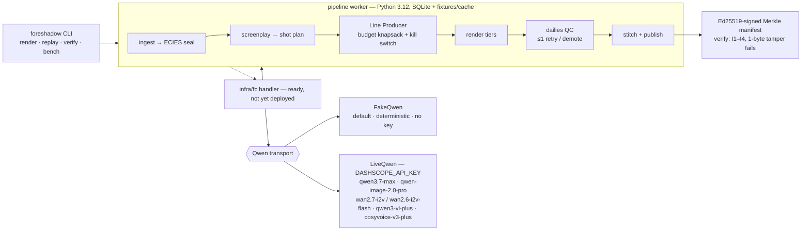

<div align="center">
  
  <h1>🎬 Foreshadow</h1>
  <p><em>An agent film crew that turns a real near-miss report into a 90-second cinematic safety film — scripted, storyboarded, shot, QC'd, and provenance-signed under a hard render budget.</em></p>
  

  <br/><br/>

  [](DEMO.md)
  [](https://qwencloud-hackathon.devpost.com/)
  [](LICENSE)

  <br/>

  
  
  
  
  
  [](https://github.com/edycu/foreshadow/actions/workflows/ci.yml)
</div>

**An agent film studio that turns a company's own near-miss incident report into
a 90-second cinematic safety re-enactment — scripted, storyboarded, shot, QC'd,
and cut by a Qwen agent crew under a hard render budget managed by a Line
Producer agent with a live cost ledger.**

A near-miss is the accident's *foreshadowing* — and foreshadowing is a narrative
device. Foreshadow turns one into the other. Drop in Tuesday's incident report,
get a film you can show at Thursday's toolbox talk. The demo ledger line —
**"$2.71 vs $15,000"** — is the pitch.

- **8 distinct Qwen Cloud surfaces**, one bill. Screenwriter (`qwen3.7-max` +
  thinking) → Line Producer allocator (`qwen3.6-flash`) → Art Dept
  (`qwen-image-2.0-pro`) → DP (`wan2.7-i2v` / `wan2.6-i2v-flash` async tasks) →
  QC Critic (`qwen3-vl-plus`) → Narrator (`cosyvoice-v3-plus`).
- **The budget IS the product.** The track asks for "maximum output quality
  under a limited token budget"; the Line Producer makes that constraint the
  signature feature — a knapsack allocator that tiers every shot by narrative
  weight, prices every demotion into a regret log, and enforces a hard-cap kill
  switch at 2.5× budget.
- **Cryptographic provenance.** Every film ships an Ed25519-signed, Merkle-rooted
  manifest. `foreshadow verify` re-hashes every artifact and proves invariants
  I1–I4 — offline, with zero keys.

## 🏗️ Architecture (as built, offline-first)



<sub>**As built** = what runs today (offline, keyless, on FakeQwen). The full deployed topology — Next.js war-room UI, Supabase, live Function Compute + OSS — is specified in `../ARCHITECTURE.md` / `../SPEC.md` and is pending (see **Status**).</sub>

## 🚀 Quickstart (offline, zero API keys)

```bash
python -m venv .venv
./.venv/bin/pip install -e ".[dev]"             # includes the offline animatic renderer
./.venv/bin/pytest                              # -> 418 passed, 100% coverage
./.venv/bin/foreshadow replay --incident forklift
```

`replay` rebuilds the exact demo film from committed fixtures with **no network
and no key**, then verifies its signed manifest against the committed cache
byte-for-byte. (`foreshadow` is on the venv path after install; the task's
`foreshadow replay --incident forklift` works once `.venv/bin` is active.)

## 🧪 Tests

**418 tests, all passing at 100% coverage** (`./.venv/bin/pytest` after
`pip install -e ".[dev]"`, fully offline via a session-wide socket guard).
Coverage includes: the Line Producer knapsack math,
budget caps and the 2.5×B kill switch; invariants I1–I4 (each failed in
isolation, plus a 1-byte tamper of every committed artifact); schema
validation with reject-retry; Ed25519 sign/verify; ECIES seal/unseal
round-trips; byte-identical replay determinism; the ledger, regret log, and
storage layer; and the full 11-stage pipeline end-to-end for all three seeds.

```
418 passed
```

## 🕹️ What a judge runs

```bash
./.venv/bin/pytest                              # 418 passed, 100% cov, offline
./.venv/bin/python scripts/verify_offline.py    # socket-guarded replay + I1–I4, exit 0
./.venv/bin/foreshadow replay --incident forklift   # rebuild the demo film, zero keys
./.venv/bin/foreshadow preview --incident forklift  # → forklift_animatic.mp4 (real, playable)
```

`preview` renders a **real, playable `.mp4`** you can open in any player — an
*offline storyboard animatic* (title cards + the narration script + Ken-Burns
motion, all drawn from the deterministic shot plan). It is **not** AI-generated
footage: FakeQwen never calls `wan`, so there is no generated video; the animatic
is clearly stamped as such and exists so a judge has something watchable without a
key. (The `wan2.7-i2v` path in `qwen/live.py` builds the real request payload and
runs only with `DASHSCOPE_API_KEY`.)

Benchmarks (per-surface latency/cost + the $2/$4/$8 budget sweep) live in
[`docs/BENCH.md`](docs/BENCH.md); regenerate with `foreshadow bench`.

## 🧩 Why ONLY Qwen Cloud

Take Qwen Cloud out and Foreshadow is not one integration — it is four vendors,
an async render queue, and a cross-vendor cost normalizer, and the single-bill
ledger that *is* the demo becomes impossible.

| # | Qwen surface | Without it |
|---|---|---|
| 1 | `qwen3.7-max` + thinking (screenplay) | a separate frontier-LLM vendor + prompt router |
| 2 | structured output JSON schema (ShotPlan / BudgetDecision / QCVerdict) | Zod/retry glue + ~10% parse-failure handling |
| 3 | `qwen-image-2.0-pro` (character sheet + storyboards) | a Midjourney/FAL account + style-consistency hacks |
| 4 | `wan2.7-i2v` / `wan2.6-i2v` async tasks (hero shots) | a Runway/Pika vendor + webhook infra |
| 5 | `wan2.6-i2v-flash` (cheap tier) | no second price tier → the budget-ladder pitch dies |
| 6 | `qwen3-vl-plus` (grounded dailies QC) | a GPT-V-class second vendor just for review |
| 7 | `cosyvoice-v3-plus` (narration) | an ElevenLabs subscription |
| 8 | Batch API −50% (storyboard fan-out) | full-price fan-out; the sweep costs 2× |

Code citations: `agents/screenwriter.py` (1, 2), `agents/art.py` (3),
`render/orchestrator.py` (4, 5), `agents/qc.py` (6), `render/narrate.py` (7),
`batch.py` (8). All model ids are pinned in `config.ALLOWED_MODELS` and any
other id raises before a call is built.

**Honest limitations:** `wan` clips occasionally drift props between shots (QC
demotes, cannot fix); async tasks have no webhook, so we poll; structured output
needed one reject-retry guard for enum drift. See
[`docs/friction-log.md`](docs/friction-log.md).

## ✅ Testing & CI

```bash
# ── Code Quality ─────────────────────────────
ruff check .                                     # lint
mypy src                                         # type check (advisory)
pytest --cov=src/foreshadow --cov-report=term    # unit tests + coverage

# ── Offline judge-path proof ─────────────────
python scripts/verify_offline.py                 # socket-guarded replay + I1-I4

# ── Security ──────────────────────────────────
pip-audit                                        # dependency vulnerability scan
```

| Layer | Tool | Status |
|---|---|---|
| Code Quality | ruff | ✅ clean |
| Type Checking | mypy | ⚠️ advisory (3 pre-existing gaps, non-blocking) |
| Unit Testing | pytest (418 tests, 100% coverage) | ✅ |
| Offline Judge Proof | `scripts/verify_offline.py` (socket-guarded) | ✅ |
| Security (SAST) | CodeQL (`python`) | ✅ |
| Security (SCA) | Dependabot (`pip` + `github-actions`) + `pip-audit` | ✅ |
| Secret Scanning | TruffleHog | ✅ |
| CI/CD | 5-stage GitHub Actions pipeline (Quality → Security → Build → Offline Verify → Deploy Gate) | ✅ |

CI runs `.github/workflows/ci.yml` on every push/PR to `main`; CodeQL runs on
its own schedule plus push/PR via `.github/workflows/codeql.yml`.

## 🔏 Provenance & verification

```bash
./.venv/bin/foreshadow verify \
  fixtures/cache/forklift/film.mp4 fixtures/cache/forklift/manifest.json
```

Re-hashes every artifact, rebuilds the Merkle root, checks the Ed25519
signature, and evaluates I1–I4 (exit 0 = PASS). The manifest format, Merkle
construction, and threat model are specified in
[`docs/SPEC-PROVENANCE.md`](docs/SPEC-PROVENANCE.md). Signing proves *pipeline
integrity, not narrative truth* — documented honestly, not hidden.

Demo signer public key (Ed25519): `544aa661bf072330...` (derived
deterministically from a public seed so replays are byte-identical; the demo key
proves mechanism, not identity).

## 📋 Status / Pending (honest)

Everything above is real and green **offline**. The following are intentionally
scoped for the offline-first build and are **not** claimed as done:

- **Next.js war-room UI — deferred.** The CLI + logs are the demo surface. The
  UI (agent lanes, live ledger, player) is designed in `UI.md` but not built.
- **Live Qwen integration — behind `DASHSCOPE_API_KEY`.** Chat surfaces are
  fully implemented on the OpenAI-compatible endpoint; the image/video/TTS
  surfaces are payload-complete builders that raise `LiveSurfaceNotVerified`
  until a key is present (`src/foreshadow/qwen/live.py`). The graded artifact
  runs on `FakeQwen`.
- **Alibaba Function Compute — not yet deployed.** `infra/fc/handler.py` +
  `s.yaml` are complete and the handler runs offline; no live console recording
  is claimed (see [`infra/fc/PROOF.md`](infra/fc/PROOF.md)).
- **Media on the offline path — stubs, plus a watchable animatic.** The graded
  replay writes deterministic *stub* media (`film.mp4` is a signed edit-list
  manifest, not decodable video) so replay stays byte-identical on every machine.
  For a watchable artifact, `foreshadow preview` renders a **real, playable
  `.mp4`** storyboard animatic from that same deterministic data (Pillow +
  imageio-ffmpeg, optional `[preview]` deps). This is **not** `wan`-generated
  footage — it is honestly an animatic. Real AI video (`wan2.7-i2v`) runs only
  behind `DASHSCOPE_API_KEY`.
- **x402 pay-per-film API — stretch, not built.** Flagged in COMPLEXITY.md as
  never-claimed-unless-finished.
- **PyPI publish — pending.** Installable from the repo with `pip install -e`.

## 🗂️ Layout

```
build/
├── .github/               CI/CD, CodeQL, Dependabot, community health files
├── src/foreshadow/        pipeline, agents, crypto, qwen transports, CLI
├── tests/                 418 offline tests
├── seeds/                 3 OSHA-300-style incidents (deterministic)
├── fixtures/cache/        committed replay artifacts (the OSS archive, locally)
├── scripts/               bench.py · verify_offline.py · check_submission_readiness.py · regen_cache.py
├── docs/                  BENCH.md · SPEC-PROVENANCE.md · friction-log.md
├── infra/fc/              handler.py · s.yaml · PROOF.md
├── .env.example           optional DASHSCOPE_API_KEY + runtime path overrides
└── LICENSE, pyproject.toml
```

## 🤝 Contributing

Bug reports, feature ideas, and PRs are welcome — see
[`.github/CONTRIBUTING.md`](.github/CONTRIBUTING.md) for the dev setup and the
pre-PR checklist (`ruff check .`, `pytest --cov`, `scripts/verify_offline.py`).
Please also read the
[Code of Conduct](.github/CODE_OF_CONDUCT.md) and the
[Security Policy](.github/SECURITY.md) (private disclosure for vulnerabilities).

## 📄 License

[MIT](LICENSE) © 2026 Edy Cu.
